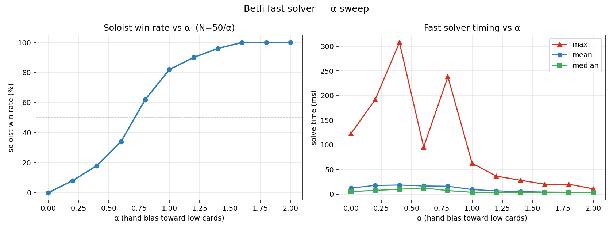

# Experiment 2 — Betli α sweep

## Goal
Characterize the betli fast solver across the full α range: how soloist win
rate and solve time depend on hand-bias strength, on a paired-seed setup so
the comparison across α is clean.

Prerequisite: the fast solver from experiment 1.

## Setup
- α ∈ [0.0, 2.0], step 0.2 → 11 points
- N = 50 seeds per α
- Same 50 seeds reused across every α (paired comparison)
- Fast betli solver (early-WIN predicate + defender equivalence-group cull)

## Results

| α   | sol win  | mean (ms) | median (ms) | max (ms) |
|-----|----------|-----------|-------------|----------|
| 0.0 |    0.0 % |    12     |      5      |    120   |
| 0.2 |    8.0 % |    18     |      8      |    190   |
| 0.4 |   18.0 % |    18     |     10      |    310   |
| 0.6 |   34.0 % |    16     |     12      |    100   |
| 0.8 |   62.0 % |    16     |      7      |    240   |
| 1.0 |   82.0 % |     9     |      4      |     60   |
| 1.2 |   90.0 % |     7     |      3      |     40   |
| 1.4 |   96.0 % |     5     |      3      |     30   |
| 1.6 |  100.0 % |     4     |      3      |     20   |
| 1.8 |  100.0 % |     4     |      3      |     20   |
| 2.0 |  100.0 % |     4     |      3      |     10   |

## Takeaways
- Win-rate curve is a clean S-shape, crossing 50 % between α≈0.6 and α≈0.8 —
  matches the level we've been using as the "interesting" regime.
- Solver is slowest exactly where verdicts are most contested (α ∈ [0.2, 0.8]);
  even there the worst single deal solved in 310 ms.
- Once α ≥ 1.6 the soloist trivially wins and the predicate fires almost
  immediately (~3 ms median).
- Total wall time for the whole 550-deal sweep: **~5.7 s**.

## Files
- `README.md` — this summary
- `alpha_sweep.py` — sweep driver
- `plot_sweep.py` — renders `sweep.png` from `sweep.json`
- `sweep.json` — raw results
- `sweep.png` — visualization
