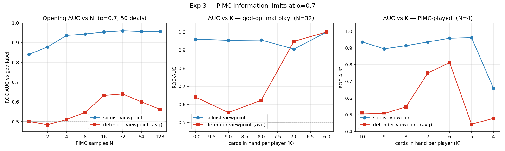

# Experiment 3 — PIMC information limits at α=0.7

## Goal
Characterize how well PIMC predicts the true (god) outcome of a betli deal,
and how that quality scales with **N** (samples per decision) and **K**
(cards remaining in hand). Run separately for the soloist viewpoint (sees
the talon) and the defender viewpoint (talon hidden, averaged across the
two defenders).

50 deals dealt at α=0.7 throughout. ROC-AUC vs the god verdict is the
quality metric (the god solve at the *current* state, not the opening
verdict, so the label updates as the game progresses).

## Part A — Opening AUC vs N
At the opening position only. Sample N worlds per viewpoint, perfect-solve
each, treat win-rate-across-samples as the predicted probability.

| N   | AUC_sol | AUC_def | sol p̄ | def p̄ |
|-----|---------|---------|--------|--------|
|   1 |  0.840  |  0.500  | 0.42   | 0.00   |
|   2 |  0.879  |  0.484  | 0.47   | 0.01   |
|   4 |  0.936  |  0.510  | 0.45   | 0.01   |
|   8 |  0.944  |  0.547  | 0.44   | 0.01   |
|  16 |  0.954  |  0.632  | 0.41   | 0.01   |
|  32 |  0.960  |  0.640  | 0.42   | 0.01   |
|  64 |  0.957  |  0.600  | 0.43   | 0.01   |
| 128 |  0.957  |  0.562  | 0.42   | 0.01   |

- Soloist AUC plateaus near **0.96** by N≈16 — close to the info-set ceiling.
- Defender AUC peaks at **0.64** around N=32 and *degrades* past that. The
  defender mean predicted prob stays around 1 % regardless of N — the
  defender info-set is structurally noisy (own hand strong because α=0.7
  pushes low cards onto soloist) so almost every sampled world resolves
  as defender-win. With more samples that noise smears across all deals
  and the AUC ranking erodes rather than sharpens.

## Part B — AUC vs K, god-optimal play (N=32)
Each deal is played with god-optimal moves on both sides. At every trick
start where the on-move player has K cards left we record the fresh god
label + the per-viewpoint PIMC probability with N=32 samples (voids fed
from the actual playout).

| K   |  n  | pos_rate | AUC_sol | AUC_def | sol p̄ | def p̄ |
|-----|-----|----------|---------|---------|--------|--------|
| 10  |  50 |  38 %    |  0.960  |  0.640  | 0.42   | 0.01   |
|  9  |  50 |  60 %    |  0.954  |  0.554  | 0.58   | 0.02   |
|  8  |  44 |  73 %    |  0.956  |  0.622  | 0.71   | 0.07   |
|  7  |  31 |  94 %    |  0.905  |  0.948  | 0.88   | 0.15   |
|  6  |  28 |  96 %    |  1.000  |  1.000  | 0.91   | 0.24   |
|  5+ | ≤23 | 100 %    |   nan   |   nan   | …      | …      |

- Soloist AUC is already at ceiling at the opening and stays there.
- Defender AUC sits near 0.6 through K=8, then jumps to **0.95 at K=7,
  1.0 at K=6** — once the info-set tightens (fewer hidden cards, voids
  accumulated from sensible god play) the defender viewpoint sees what
  the soloist sees.
- Below K=6 the dataset collapses to one-class (only sol-win trajectories
  survive — see "betli truncation" below) so AUC is undefined.

## Part C — AUC vs K, PIMC-played trajectory (N=4)
Same protocol, but all three players choose moves via PIMC(N=4) instead
of god-optimal. 50 deals, α=0.7.

| K   |  n  | pos_rate | AUC_sol | AUC_def | sol p̄ | def p̄ |
|-----|-----|----------|---------|---------|--------|--------|
| 10  |  50 |  38 %    |  0.936  |  0.510  | 0.45   | 0.01   |
|  9  |  50 |  62 %    |  0.895  |  0.507  | 0.61   | 0.03   |
|  8  |  50 |  76 %    |  0.913  |  0.547  | 0.69   | 0.10   |
|  7  |  50 |  80 %    |  0.936  |  0.750  | 0.79   | 0.18   |
|  6  |  50 |  86 %    |  0.958  |  0.812  | 0.83   | 0.30   |
|  5  |  50 |  92 %    |  0.962  |  0.443  | 0.91   | 0.46   |
|  4  |  50 |  94 %    |  0.660  |  0.479  | 0.98   | 0.63   |
|  3  |  50 | 100 %    |   nan   |   nan   | 0.99   | 0.76   |

### Final-outcome confusion (god opening vs PIMC played-out, N=4)
|                 | pimc=soloist | pimc=defenders |
|-----------------|:------------:|:--------------:|
| **god=soloist**   |      19      |       0        |
| **god=defenders** |      31      |       0        |

- **Defenders convert 0/31** of their theoretically-won deals when both
  sides play PIMC(N=4). For comparison the N=1 quick test had 4/31 —
  raising N makes the policy *more* deterministic, and the deterministic
  defender move is uniformly bad because the info-set bias points the
  wrong way (same pathology as opening AUC dropping past N=32).
- Defender AUC under PIMC play tops out at **0.81 at K=6** — much weaker
  than the god-play 1.0 at the same K. PIMC defenders don't play moves
  that tighten the info-set the way god defenders do (e.g. revealing
  voids early), so the determinizer is slower to catch up.
- All 50 deals reach K=3 — betli truncation barely fires because
  PIMC-defenders almost never force the soloist to take a trick.
- Wall time: 16.8 s for the N=1 sanity run, 52.6 s for N=4.

## Takeaways
1. **Soloist viewpoint is near-optimal even at small N.** Information
   ceiling ~0.96 AUC at the opening; full 1.0 by mid-game.
2. **Defender viewpoint is information-limited at α=0.7.** Opening AUC
   tops out around 0.64 and *gets worse* with too many samples. Adding
   compute can't fix it — the bias is in the info-set.
3. **Game-state tightening matters more than N for defenders.** Under
   god play, defender AUC jumps from ~0.6 to 1.0 between K=8 and K=6
   once voids and a shrinking pool kick in.
4. **PIMC-as-policy creates its own pathology.** More samples push the
   defender policy toward a deterministic-but-wrong move; defender win
   rate drops from 13 % (N=1) to 0 % (N=4) on theoretically-won deals.

## Files
- `README.md` — this writeup
- `plot.py` — renders `exp3_summary.png`
- `exp3_summary.png` — three-panel visualization
- `pimc_opening_auc_sweep.py` — part A driver
- `pimc_auc_vs_cards.py` — part B driver (god-play traversal)
- `pimc_play_auc_vs_cards.py` — part C driver (PIMC-play traversal)
- `pimc_opening_estimate.py` — simpler N=1 opening sanity (used while
  scoping the experiment)
- `opening_auc_sweep.json`, `auc_vs_cards_godplay.json`,
  `auc_vs_cards_pimcplay_n4.json` — raw results
